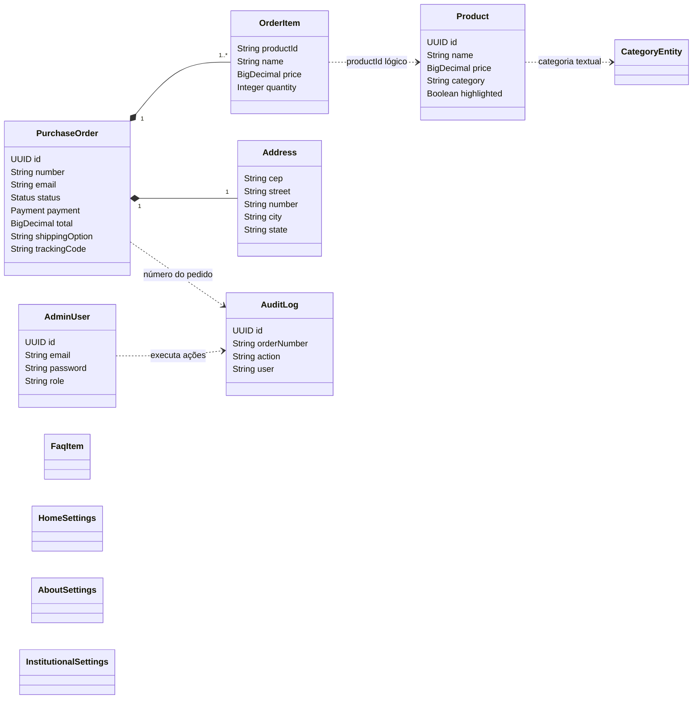
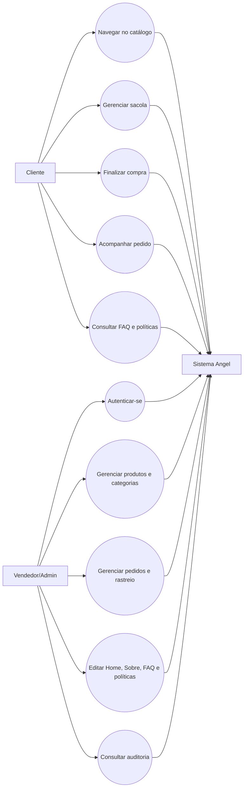
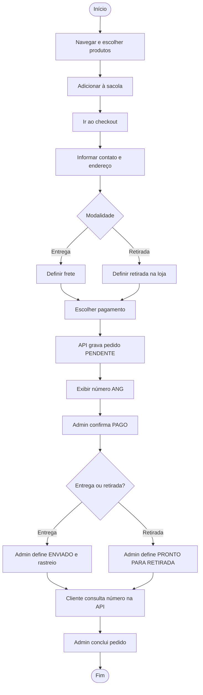
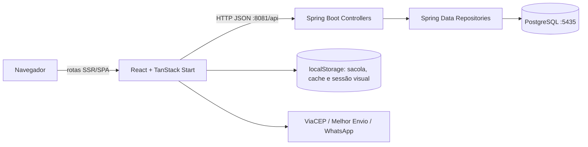

# Documentação funcional e técnica — Angel

**Versão analisada:** 24/07/2026
**Escopo:** código presente no repositório `angel-leo` após a correção do fluxo de pedidos, das páginas institucionais e da proteção visual do painel administrativo.

## 1. Introdução

O Angel é um e-commerce de joias em prata 925 e cosméticos. O sistema reúne uma loja virtual pública, uma jornada de compra e um painel administrativo para o vendedor. A solução é separada em frontend React/TanStack Start e API REST Spring Boot, com persistência em PostgreSQL.

Esta documentação foi construída a partir do código-fonte, das entidades JPA, dos controllers REST e das rotas de interface. Onde o Hibernate deriva nomes físicos de tabelas ou colunas sem anotação explícita, o nome indicado segue a estratégia padrão `snake_case`.

## 2. Descrição funcional do produto

Para o cliente, o produto permite conhecer a marca, consultar e filtrar produtos, abrir detalhes, montar uma sacola, escolher entrega ou retirada, finalizar o pedido e acompanhar seu andamento pelo número do pedido. Também disponibiliza FAQ, informações institucionais, termos de uso, política de trocas e política de privacidade.

Para o vendedor, o painel permite acompanhar indicadores e pedidos, editar produtos e categorias, selecionar destaques, manter o conteúdo da Home, Sobre, FAQ e páginas institucionais, além de consultar registros de auditoria. O andamento de um pedido diferencia entrega (`Enviado`) de retirada (`Pronto para Retirada`).

## 3. Atores e perfis

| Perfil | Descrição |
|---|---|
| Visitante/cliente | Navega no catálogo, usa a sacola, finaliza e consulta pedidos sem conta individual. |
| Vendedor/administrador | Entra no painel e gerencia catálogo, pedidos e conteúdos. |
| Serviços externos | ViaCEP e Melhor Envio são referenciados pelo frontend para endereço/frete; WhatsApp é usado como canal de atendimento. |

## 4. Requisitos funcionais

| Código | Nome do requisito | Descrição | Justificativa |
|---|---|---|---|
| RF-001 | Exibir vitrine | Apresentar Home com hero, benefícios e produtos em destaque. | Comunicar a marca e conduzir à compra. |
| RF-002 | Listar produtos | Exibir catálogo responsivo com dados comerciais. | Permitir descoberta do portfólio. |
| RF-003 | Filtrar e ordenar | Filtrar por categoria/preço e ordenar resultados. | Reduzir o esforço para encontrar produtos. |
| RF-004 | Consultar produto | Mostrar imagem, descrição, preço e detalhes em modal. | Apoiar a decisão de compra. |
| RF-005 | Gerenciar sacola | Adicionar, remover e alterar quantidades, calculando totais. | Formar a intenção de compra. |
| RF-006 | Calcular entrega | Receber CEP e modalidade de entrega/retirada. | Informar custo e viabilizar expedição. |
| RF-007 | Finalizar pedido | Coletar contato, endereço, itens e pagamento e registrar o pedido. | Converter a sacola em venda. |
| RF-008 | Identificar pedido | Gerar número público no padrão `ANG-...`. | Permitir referência e rastreamento. |
| RF-009 | Acompanhar pedido | Consultar diretamente a API por número e mostrar a linha de progresso. | Dar visibilidade atualizada ao cliente. |
| RF-010 | Atualizar status | Permitir ao vendedor definir Pendente, Pago, Enviado/Pronto para Retirada e Concluído. | Refletir a operação real do pedido. |
| RF-011 | Registrar rastreio | Salvar código de rastreio para pedidos enviados. | Permitir acompanhamento logístico. |
| RF-012 | Autenticar administrador | Validar e-mail e senha no backend antes de liberar o painel. | Restringir informações comerciais. |
| RF-013 | Gerenciar produtos | Criar, editar e excluir produtos. | Manter catálogo e preços. |
| RF-014 | Gerenciar categorias | Criar, listar e remover categorias. | Organizar o catálogo. |
| RF-015 | Gerenciar destaques | Selecionar exatamente quatro produtos destacados. | Controlar a curadoria da Home. |
| RF-016 | Configurar Home | Alterar hero, valores e destaques. | Permitir manutenção editorial. |
| RF-017 | Configurar Sobre | Alterar textos, imagem e indicadores institucionais. | Atualizar narrativa da marca sem código. |
| RF-018 | Gerenciar FAQ | Criar, editar e excluir perguntas e respostas. | Manter o autoatendimento. |
| RF-019 | Configurar políticas | Alterar Termos, Trocas/Devoluções e Privacidade no painel. | Manter textos legais e operacionais. |
| RF-020 | Auditar operações | Registrar e listar criação, alteração de status e rastreio. | Dar rastreabilidade às ações. |
| RF-021 | Alternar tema | Oferecer modo claro/escuro. | Melhorar preferência visual e legibilidade. |
| RF-022 | Contato por WhatsApp | Disponibilizar atalho para atendimento. | Facilitar suporte e conversão. |

## 5. Requisitos não funcionais

| Código | Nome do requisito | Descrição | Justificativa |
|---|---|---|---|
| RNF-001 | Responsividade | Interfaces adaptáveis a celular e desktop. | Atender navegação móvel e gestão em diferentes telas. |
| RNF-002 | Usabilidade | Feedback por toasts, estados de carregamento e navegação agrupada. | Tornar ações compreensíveis. |
| RNF-003 | Acessibilidade básica | Componentes Radix, labels e controles por teclado quando suportados. | Ampliar acesso e consistência. |
| RNF-004 | Integridade | Tipos TypeScript, enums Java e constraints JPA. | Evitar estados e dados inválidos. |
| RNF-005 | Persistência | Dados de negócio armazenados em PostgreSQL. | Preservar informação entre sessões/dispositivos. |
| RNF-006 | Segurança de senha | Senhas persistidas com BCrypt; legado em texto é atualizado no login. | Reduzir exposição de credenciais. |
| RNF-007 | Proteção visual | Conteúdo administrativo não deve ser montado antes da checagem de autenticação. | Evitar exposição momentânea na tela de login. |
| RNF-008 | Segurança de conteúdo | Políticas são renderizadas como texto, sem injeção de HTML. | Evitar XSS por conteúdo administrativo. |
| RNF-009 | Observabilidade | Operações de pedido geram auditoria. | Facilitar suporte e investigação. |
| RNF-010 | Manutenibilidade | Separação frontend/backend, componentes, stores, controllers e repositories. | Facilitar evolução independente. |
| RNF-011 | Compatibilidade | Java 21 e navegadores modernos com ES modules. | Usar plataformas atuais e suportadas. |
| RNF-012 | Desempenho percebido | Estado local e renderização híbrida/SSR. | Reduzir espera na navegação. |

### Segurança implementada

O backend usa Spring Security com sessão stateless e JWT HMAC SHA-256. O login valida BCrypt e emite token com escopo `ADMIN`; endpoints administrativos validam assinatura, expiração e autoridade. Não existe credencial fixa no código: o primeiro administrador é criado opcionalmente pelas variáveis `ADMIN_INITIAL_*`. O CORS aceita apenas as origens configuradas em `CORS_ALLOWED_ORIGINS`.

## 6. Funcionalidades implementadas

| Código | Funcionalidade | Área | Situação |
|---|---|---|---|
| FI-001 | Home configurável | Pública/Admin | Implementada |
| FI-002 | Catálogo, busca, filtros e ordenação | Pública | Implementada |
| FI-003 | Detalhes de produto | Pública | Implementada |
| FI-004 | Sacola persistida no navegador | Pública | Implementada |
| FI-005 | Checkout com entrega/retirada e formas de pagamento | Pública | Implementada |
| FI-006 | Confirmação e número de pedido | Pública | Implementada |
| FI-007 | Rastreamento consultado no backend | Pública | Implementada/corrigida |
| FI-008 | Status Pago, Enviado e Pronto para Retirada | Admin/Pública | Implementada/corrigida |
| FI-009 | Código de rastreio | Admin/Pública | Implementada/corrigida |
| FI-010 | Login administrativo sem montagem antecipada do painel | Admin | Implementada/corrigida |
| FI-011 | Dashboard administrativo | Admin | Implementada |
| FI-012 | CRUD de produtos | Admin | Implementada |
| FI-013 | Gestão de categorias | Admin | Implementada |
| FI-014 | Curadoria de quatro destaques | Admin | Implementada |
| FI-015 | Gestão da página Sobre | Admin | Implementada |
| FI-016 | CRUD de FAQ | Admin | Implementada |
| FI-017 | Gestão de Termos, Trocas e Privacidade | Admin/Pública | Implementada |
| FI-018 | Auditoria de pedidos | Admin | Implementada |
| FI-019 | Tema claro/escuro | Global | Implementada |
| FI-020 | Atendimento via WhatsApp | Pública | Implementada |

## 7. Regras de negócio

| Código | Regra de negócio | Descrição | Funcionalidade relacionada |
|---|---|---|---|
| RN-001 | Status inicial | Novo pedido sem status recebe `PENDENTE`. | Checkout/pedidos |
| RN-002 | Identificador público | Pedido sem número recebe um código iniciado por `ANG-`. | Checkout/rastreamento |
| RN-003 | Estados de entrega | Entrega usa `ENVIADO`; retirada usa `PRONTO_PARA_RETIRADA`. | Gestão/rastreamento |
| RN-004 | Normalização de status | API aceita descrição amigável ou nome do enum e converte para um estado canônico. | Gestão de pedidos |
| RN-005 | Rastreio de entrega | Campo de rastreio é solicitado quando pedido de entrega está como Enviado. | Gestão de pedidos |
| RN-006 | Progresso | Pendente=0, Pago=1, Enviado/Pronto=2 e Concluído=3. | Meu Pedido |
| RN-007 | Consulta flexível | Pedido pode ser localizado por UUID interno ou número público. | API de pedidos |
| RN-008 | Auditoria automática | Criação, status e rastreio geram log, sem impedir a venda se o log falhar. | Auditoria |
| RN-009 | Categoria padrão | Produto sem categoria recebe `prata`. | Produtos |
| RN-010 | Categorias iniciais | Base vazia cria `prata` e `cosmeticos`. | Categorias |
| RN-011 | Quatro destaques | Atualização de destaques exige exatamente quatro UUIDs. | Home/destaques |
| RN-012 | Destaque alternativo | Se houver menos de quatro destacados, a API retorna até quatro produtos existentes. | Home |
| RN-013 | FAQ inicial | Base vazia recebe três perguntas padrão. | FAQ |
| RN-014 | Configuração singleton | Home, Sobre e páginas institucionais usam o registro de ID 1. | Conteúdo |
| RN-015 | Texto obrigatório | Conteúdo institucional vazio é substituído pelo texto padrão. | Políticas |
| RN-016 | Login confirmado | O frontend só cria a sessão local depois de sucesso da API e armazena o JWT. | Autenticação |
| RN-017 | Hash de senha | Somente senhas BCrypt são aceitas e persistidas. | Autenticação |
| RN-018 | Exclusão de produto | Endpoint exclui fisicamente por UUID; `deletedAt` existe, mas soft delete não é aplicado. | Produtos |
| RN-019 | Autorização administrativa | Todo endpoint não explicitamente público exige JWT válido com escopo ADMIN. | Segurança |
| RN-020 | Administrador inicial | Bootstrap só ocorre com e-mail e senha fornecidos pelo ambiente; senha mínima de 12 caracteres. | Segurança |

## 8. Telas

| Tela/rota | Explicação breve |
|---|---|
| Home `/` | Apresenta marca, hero, benefícios e produtos em destaque. |
| Produtos `/produtos` | Catálogo com categorias, preço, ordenação, cards e detalhes. |
| Sobre `/sobre` | História, proposta, imagem e indicadores da Angel. |
| FAQ `/faq` | Perguntas frequentes em acordeão. |
| Checkout `/checkout` | Revisa itens, coleta contato/endereço, calcula modalidade e registra pagamento/pedido. |
| Pedido concluído `/pedido-concluido` | Confirma a compra e orienta o acompanhamento. |
| Meu Pedido `/meu-pedido` | Busca o número na API e mostra status, etapas, itens, endereço e rastreio. |
| Termos `/termos` | Exibe o texto de Termos mantido pelo administrador. |
| Trocas `/trocas` | Exibe política de trocas/devoluções mantida pelo administrador. |
| Privacidade `/privacidade` | Exibe política de privacidade mantida pelo administrador. |
| Login `/admin/login` | Solicita credenciais e só libera sessão após validação do backend. |
| Dashboard `/admin` | Resume vendas, pedidos, faturamento e atalhos. |
| Pedidos `/admin/pedidos` | Lista detalhes e altera status/rastreio. |
| Produtos `/admin/produtos` | Cria, edita, exclui e seleciona destaques. |
| Categorias `/admin/categorias` | Mantém categorias do catálogo. |
| Página Home `/admin/home` | Edita hero, imagem, benefícios e conteúdo da página inicial. |
| Sobre Nós `/admin/sobre` | Edita texto, imagem e indicadores. |
| FAQ `/admin/faq` | Mantém perguntas e respostas. |
| Textos e Políticas `/admin/configuracoes` | Mantém dados básicos locais e os três textos institucionais persistidos. |
| Auditoria `/admin/auditoria` | Consulta histórico de operações em pedidos. |

## 9. Tecnologias

| Tecnologia | Finalidade no projeto | Justificativa de uso |
|---|---|---|
| React 19 | Construção da interface por componentes. | Ecossistema amplo e composição declarativa. |
| TypeScript 5.8 | Tipagem do frontend. | Reduz erros de integração e refatoração. |
| TanStack Start/Router | SSR e rotas baseadas em arquivos. | Organização previsível e renderização híbrida. |
| Vite 8 | Desenvolvimento e build. | Feedback rápido e bundle moderno. |
| Tailwind CSS 4 | Estilização utilitária. | Consistência e rapidez de implementação. |
| Radix UI/shadcn | Componentes de interface acessíveis. | Comportamentos complexos reutilizáveis. |
| React Hook Form + Zod | Formulários e validação. | Validação tipada e eficiente. |
| Lucide React | Ícones. | Biblioteca leve e visualmente consistente. |
| Sonner | Notificações toast. | Feedback não bloqueante. |
| Spring Boot 4.1 | API REST e composição do backend. | Convenções e infraestrutura Java madura. |
| Spring Security/OAuth2 Resource Server | Validação JWT e autorização. | Proteção stateless dos endpoints administrativos. |
| Flyway | Migrações versionadas. | Evolução reproduzível e auditável do schema. |
| H2 | Banco isolado de integração. | Testes rápidos em modo compatível com PostgreSQL. |
| Java 21 | Linguagem do backend. | Versão LTS moderna. |
| Spring MVC | Controllers HTTP. | Modelo REST direto e consolidado. |
| Spring Data JPA/Hibernate | Persistência ORM. | Reduz código repetitivo de acesso a dados. |
| PostgreSQL 17 | Banco relacional. | Integridade, transações e tipos robustos. |
| BCrypt | Hash de senhas. | Algoritmo apropriado para credenciais. |
| Lombok | Getters, setters e construtores. | Reduz boilerplate nas entidades. |
| MapStruct | Mapeamento DTO/entidade (dependência presente). | Mapeamento compilado; uso atual é limitado a produto. |
| Maven | Build e dependências Java. | Padrão do ecossistema Spring. |
| Docker Compose | PostgreSQL local. | Ambiente reproduzível de desenvolvimento. |

## 10. Estrutura geral do repositório

```text
angel-leo/
├── README.md
├── DOCUMENTACAO_PROJETO.md
├── frontend/
│   ├── public/                 # arquivos públicos
│   ├── src/
│   │   ├── assets/             # imagens locais
│   │   ├── components/         # layout, produto, sacola e UI
│   │   ├── hooks/              # hooks reutilizáveis
│   │   ├── lib/                # API, stores, autenticação e regras de cliente
│   │   ├── routes/             # páginas públicas e administrativas
│   │   ├── router.tsx          # criação do roteador
│   │   ├── routeTree.gen.ts    # árvore gerada de rotas
│   │   ├── server.ts           # runtime de servidor
│   │   └── start.ts            # middleware TanStack Start
│   ├── package.json
│   └── vite.config.ts
└── backend/
    ├── docker-compose.yml       # PostgreSQL local na porta 5435
    ├── pom.xml
    └── src/
        ├── main/java/com/angel/backend/
        │   ├── config/          # CORS/MVC
        │   ├── controller/      # endpoints REST
        │   ├── dto/             # entrada de login/produto
        │   ├── enums/           # Status e Payment
        │   ├── mapper/          # MapStruct
        │   ├── model/           # entidades e embeddables
        │   ├── repository/      # Spring Data
        │   └── service/         # serviço de produtos
        ├── main/resources/      # application.properties
        └── test/                # teste de contexto
```

## 11. Rotas principais de interface

| Rota | Método | Descrição | Perfil de acesso |
|---|---|---|---|
| `/`, `/produtos`, `/sobre`, `/faq` | GET/navegação | Conteúdo e catálogo públicos. | Público |
| `/checkout`, `/pedido-concluido` | GET/navegação | Jornada de compra e confirmação. | Público |
| `/meu-pedido` | GET/navegação | Consulta de pedido pelo parâmetro `n`. | Público |
| `/termos`, `/trocas`, `/privacidade` | GET/navegação | Páginas institucionais. | Público |
| `/admin/login` | GET/navegação | Autenticação do vendedor. | Público |
| `/admin` | GET/navegação | Dashboard. | Administrador (guarda frontend) |
| `/admin/pedidos` | GET/navegação | Gestão de pedidos. | Administrador (guarda frontend) |
| `/admin/produtos` | GET/navegação | Gestão de produtos/destaques. | Administrador (guarda frontend) |
| `/admin/categorias` | GET/navegação | Gestão de categorias. | Administrador (guarda frontend) |
| `/admin/home`, `/admin/sobre`, `/admin/faq` | GET/navegação | Gestão editorial. | Administrador (guarda frontend) |
| `/admin/configuracoes` | GET/navegação | Gestão de textos e políticas. | Administrador (guarda frontend) |
| `/admin/auditoria` | GET/navegação | Histórico operacional. | Administrador (guarda frontend) |

## 12. Endpoints REST

> Endpoints marcados como Admin exigem `Authorization: Bearer <jwt>` com escopo `ADMIN`.

| Rota | Método | Descrição | Perfil funcional |
|---|---|---|---|
| `/api/auth/login` | POST | Validar credenciais e devolver token. | Público |
| `/api/auth/me` | GET | Obter administrador padrão. | Admin |
| `/api/produtos` | GET | Listar produtos. | Público |
| `/api/produtos` | POST | Criar produto. | Admin |
| `/api/produtos/{id}` | PUT/DELETE | Atualizar/excluir produto. | Admin |
| `/api/categorias` | GET | Listar/inicializar categorias. | Público |
| `/api/categorias` | POST | Criar categoria. | Admin |
| `/api/categorias/{name}` | DELETE | Excluir categoria. | Admin |
| `/api/destaques` | GET | Listar quatro destaques. | Público |
| `/api/destaques` | POST | Definir quatro destaques. | Admin |
| `/api/pedidos` | POST | Criar pedido. | Público |
| `/api/pedidos` | GET | Listar todos os pedidos. | Admin |
| `/api/pedidos/{idOuNumero}` | GET | Consultar pedido. | Público |
| `/api/pedidos/{idOuNumero}/status` | PATCH | Alterar status. | Admin |
| `/api/pedidos/{idOuNumero}/tracking-code` | PATCH | Alterar rastreio. | Admin |
| `/api/auditoria` | GET/POST | Listar/criar log. | Admin |
| `/api/faq` | GET | Listar FAQ. | Público |
| `/api/faq` | POST | Criar FAQ. | Admin |
| `/api/faq/{id}` | PUT/DELETE | Atualizar/excluir FAQ. | Admin |
| `/api/home-settings` | GET | Obter Home. | Público |
| `/api/home-settings` | PUT | Atualizar Home. | Admin |
| `/api/sobre-nos` | GET | Obter conteúdo Sobre. | Público |
| `/api/sobre-nos` | PUT | Atualizar conteúdo Sobre. | Admin |
| `/api/paginas-institucionais` | GET | Obter políticas. | Público |
| `/api/paginas-institucionais` | PUT | Atualizar políticas. | Admin |

## 13. Dicionário de dados e tabelas

Tipos refletem o mapeamento JPA/PostgreSQL. Campos gerados pelo Hibernate podem variar levemente conforme a versão/estratégia física.

### `product`

| Campo | Tipo | Descrição |
|---|---|---|
| id | UUID, PK | Identificador do produto. |
| name | VARCHAR, NN | Nome comercial. |
| description | TEXT | Descrição. |
| price | NUMERIC | Preço base. |
| discount_percent | INTEGER | Percentual de desconto. |
| discount_price | NUMERIC | Preço com desconto. |
| category | VARCHAR, NN | Categoria textual. |
| image_url | TEXT | URL/base64 da imagem. |
| highlighted | BOOLEAN | Indica destaque. |
| created_at, updated_at | TIMESTAMP | Datas automáticas. |
| deleted_at | TIMESTAMP | Campo reservado; soft delete não aplicado. |

### `categories`

| Campo | Tipo | Descrição |
|---|---|---|
| id | UUID, PK | Identificador. |
| name | VARCHAR, NN, UNIQUE | Nome normalizado da categoria. |

### `purchase_order`

| Campo | Tipo | Descrição |
|---|---|---|
| id | UUID, PK | Identificador interno. |
| number | VARCHAR | Número público do pedido. |
| phone, email | VARCHAR | Contato do cliente. |
| tracking_code | VARCHAR | Código logístico. |
| shipping_option | VARCHAR | `entrega` ou `retirada`. |
| created_at, updated_at | TIMESTAMP | Datas automáticas. |
| deleted_at | TIMESTAMP | Campo reservado. |
| subtotal, shipping, total | NUMERIC | Valores do pedido. |
| status | VARCHAR/enum | PENDENTE, PAGO, ENVIADO, PRONTO_PARA_RETIRADA, CONCLUIDO ou CANCELADO. |
| payment | VARCHAR/enum | PIX, CARTAO ou BOLETO. |
| cep, street, address_number, complement, neighborhood, city, state | VARCHAR | Endereço incorporado. |

### `order_items`

| Campo | Tipo | Descrição |
|---|---|---|
| purchase_order_id | UUID, FK | Pedido proprietário da coleção. |
| product_id | VARCHAR | Referência lógica ao produto. |
| name | VARCHAR | Nome congelado no momento da compra. |
| price | NUMERIC | Preço unitário congelado. |
| quantity | INTEGER | Quantidade. |

### `admin_users`

| Campo | Tipo | Descrição |
|---|---|---|
| id | UUID, PK | Identificador do administrador. |
| name | VARCHAR, NN | Nome. |
| email | VARCHAR, NN, UNIQUE | Login. |
| password | VARCHAR, NN | Hash BCrypt (legado pode ser migrado). |
| role | VARCHAR | Papel, padrão ADMIN. |
| created_at | TIMESTAMP | Cadastro. |

### `audit_logs`

| Campo | Tipo | Descrição |
|---|---|---|
| id | UUID, PK | Identificador do evento. |
| order_number | VARCHAR | Pedido relacionado. |
| action | VARCHAR | Tipo da ação. |
| user_name | VARCHAR | Autor. |
| details | TEXT | Detalhamento. |
| timestamp | TIMESTAMP | Momento automático. |

### `faqs`

| Campo | Tipo | Descrição |
|---|---|---|
| id | UUID, PK | Identificador. |
| question | VARCHAR, NN | Pergunta. |
| answer | TEXT, NN | Resposta. |

### `home_settings`

| Campo | Tipo | Descrição |
|---|---|---|
| id | BIGINT, PK | Singleton, valor 1. |
| hero_title | VARCHAR | Título principal. |
| hero_description | TEXT | Descrição principal. |
| hero_image | TEXT | Imagem principal. |

### `home_values`

| Campo | Tipo | Descrição |
|---|---|---|
| home_settings_id | BIGINT, FK | Home proprietária. |
| id | VARCHAR | Identificador do benefício. |
| title | VARCHAR | Título. |
| subtitle | VARCHAR | Complemento. |

### `home_settings_highlight_ids`

| Campo | Tipo | Descrição |
|---|---|---|
| home_settings_id | BIGINT, FK | Home proprietária. |
| highlight_ids | VARCHAR | ID textual de produto destacado. |

### `about_settings`

| Campo | Tipo | Descrição |
|---|---|---|
| id | BIGINT, PK | Singleton, valor 1. |
| subtitle | VARCHAR | Chamada superior. |
| title | TEXT | Título. |
| image_url | TEXT | Imagem. |
| paragraph1, paragraph2, paragraph3 | TEXT | Parágrafos da história. |
| stat1_number, stat2_number, stat3_number | VARCHAR | Valores dos indicadores. |
| stat1_label, stat2_label, stat3_label | VARCHAR | Rótulos dos indicadores. |
| updated_at | TIMESTAMP | Última alteração. |

### `institutional_settings`

| Campo | Tipo | Descrição |
|---|---|---|
| id | BIGINT, PK | Singleton, valor 1. |
| terms_content | TEXT, NN | Termos de uso. |
| exchanges_content | TEXT, NN | Trocas e devoluções. |
| privacy_content | TEXT, NN | Política de privacidade. |
| updated_at | TIMESTAMP | Última alteração. |

## 14. Modelagem UML



## 15. Diagrama de casos de uso



## 16. Diagrama de atividades — compra e acompanhamento



## 17. Arquitetura e fluxo de dados



O frontend usa stores próprios com `useSyncExternalStore` e mantém cache local para resposta imediata. O backend é a fonte persistente dos dados de negócio. No fluxo corrigido de pedido, mutações aguardam a resposta da API, revertem o estado otimista em caso de erro e normalizam o status devolvido. A tela Meu Pedido busca o registro diretamente no backend pelo número público.

## 18. Execução e validação

1. Configure as variáveis descritas em `backend/.env.example` e `frontend/.env.example`.
2. Banco: `cd backend && docker compose up -d` (PostgreSQL publicado em `localhost:5435`).
3. Backend: `cd backend && ./mvnw spring-boot:run` (API em `localhost:8081`).
4. Frontend: `cd frontend && npm install && npm run dev` (porta apresentada pelo Vite, normalmente 5173).

Validações realizadas nesta versão:

- `npm run build`: aprovado para cliente e SSR.
- `./mvnw test`: aprovado; três testes de integração, zero falhas/erros, usando H2, Flyway, MockMvc e JWT.

## 19. Pontos de atenção recomendados

1. Considerar cookie `HttpOnly`, `Secure` e `SameSite` no lugar de JWT em `localStorage`, com proteção CSRF.
2. Proteger a consulta pública de pedido com token de rastreamento forte ou verificação adicional.
3. Adicionar rate limiting e validações mais rigorosas ao checkout/login.
4. Usar HTTPS e um gerenciador de segredos em produção.
5. Criar rotação/revogação de tokens e trilha de login.
