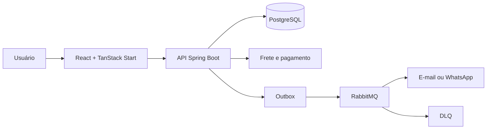

# Angel — E-commerce Full Stack

[](https://openjdk.org/)
[](https://spring.io/projects/spring-boot)
[](https://react.dev/)
[](https://www.typescriptlang.org/)
[](https://www.postgresql.org/)
[](https://www.rabbitmq.com/)
[](https://www.docker.com/)

E-commerce para catálogo, checkout, pedidos, estoque e administração de uma loja de produtos físicos. O desenvolvimento comercial foi descontinuado pelo cliente e o projeto permanece como portfólio técnico, sem dados pessoais ou credenciais reais.

> [!IMPORTANT]
> A aplicação não representa uma loja em operação. Pagamento, frete e comunicações exigem novas credenciais, homologação e revisão jurídica antes de qualquer uso comercial.

## Sobre o Projeto

O Angel substitui processos manuais de catálogo, estoque, frete e acompanhamento de pedidos por uma operação centralizada.

- **Objetivo:** demonstrar o ciclo completo de uma venda online com validações no servidor.
- **Público-alvo:** pequenos varejistas de produtos físicos.
- **Escopo:** loja responsiva, sacola, checkout, pedidos, estoque, conteúdo e painel administrativo.
- **Diferenciais:** idempotência, reserva transacional, acompanhamento seguro, 2FA, outbox e RabbitMQ com DLQ.

## Tecnologias Utilizadas

| Área | Tecnologias |
| --- | --- |
| Frontend | React 19, TypeScript 5, TanStack Start/Router/Query, Vite 8 |
| UI | Tailwind CSS 4, Radix UI, shadcn/ui, React Hook Form, Zod |
| Backend | Java 21, Spring Boot 4.1, MVC, Security, Data JPA |
| Dados | PostgreSQL 17, Hibernate, Flyway, H2 |
| Mensageria | RabbitMQ 4, Spring AMQP, outbox e DLQ |
| Integrações | Melhor Envio, InfinitePay, SMTP e webhook WhatsApp |
| Operação | Actuator, Micrometer, Prometheus, Docker e Compose |
| Qualidade | JUnit, MockMvc, Playwright, ESLint, TypeScript e Maven |

## Arquitetura

Monólito modular cliente-servidor. Não há microsserviços, Clean Architecture ou arquitetura hexagonal formal.



- O frontend renderiza as rotas e consulta dados atuais da API.
- Controllers, serviços e repositórios separam HTTP, regras de negócio e persistência.
- PostgreSQL é a fonte de verdade; Flyway versiona o schema.
- Checkout e estoque usam transações, bloqueio, reserva e idempotência.
- O outbox persiste notificações; RabbitMQ desacopla o envio aos provedores.
- Spring Security protege o painel com cookie `HttpOnly`, CSRF, TOTP e sessões revogáveis.

## Estrutura de Pastas

```text
angel/
├── backend/
│   ├── src/main/java/com/angel/backend/
│   │   ├── config/       # segurança, integrações e mensageria
│   │   ├── controller/   # endpoints REST
│   │   ├── dto/          # contratos da API
│   │   ├── model/        # entidades JPA
│   │   ├── repository/   # persistência
│   │   └── service/      # regras de negócio
│   ├── src/main/resources/db/migration/ # Flyway
│   ├── src/test/         # testes de integração
│   └── Dockerfile
├── frontend/
│   ├── e2e/              # Playwright
│   ├── src/components/   # componentes reutilizáveis
│   ├── src/lib/          # API, estado e utilitários
│   ├── src/routes/       # rotas TanStack
│   └── Dockerfile
├── ops/                  # backup e alertas
└── README.md
```

## Como Executar

### Pré-requisitos

- Java 21, Node.js 22 e npm;
- Docker com Compose;
- portas `5173`, `8081`, `5435`, `5672` e `15672`.

### Instalação

```bash
git clone git@github.com:walkermooore/angel.git
cd angel

cd frontend && npm install
cd ../backend && ./mvnw dependency:go-offline
cd ..
```

### Configuração

```bash
cp backend/.env.example backend/.env
cp frontend/.env.example frontend/.env
```

Troque o segredo JWT e as credenciais iniciais. Nunca versione `.env`, tokens ou dumps.

### Variáveis de ambiente (`.env`)

| Variável | Uso |
| --- | --- |
| `JWT_SECRET` | segredo forte para autenticação |
| `ADMIN_INITIAL_EMAIL` / `ADMIN_INITIAL_PASSWORD` | primeiro administrador |
| `DATABASE_URL`, `DATABASE_USERNAME`, `DATABASE_PASSWORD` | PostgreSQL |
| `CORS_ALLOWED_ORIGINS`, `SECURE_COOKIES` | origem e cookies |
| `RABBITMQ_ENABLED`, `RABBITMQ_*` | broker e consumidores |
| `MEDIA_DIRECTORY`, `MEDIA_PUBLIC_BASE_URL` | imagens |
| `MELHOR_ENVIO_*` | OAuth e cotação |
| `INFINITEPAY_*` | checkout e webhook |
| `SMTP_*`, `WHATSAPP_*` | comunicações |
| `VITE_API_URL`, `VITE_SITE_URL` | API e domínio do frontend |

A relação completa e valores locais estão em `backend/.env.example` e `frontend/.env.example`. Integrações externas permanecem desativadas por padrão.

### Executando localmente

```bash
# Infraestrutura
docker compose -f backend/docker-compose.yml up -d

# Terminal 1: API
cd backend
set -a && source .env && set +a
./mvnw spring-boot:run

# Terminal 2: frontend
cd frontend
npm run dev
```

| Serviço | URL |
| --- | --- |
| Loja | <http://localhost:5173> |
| API | <http://localhost:8081/api> |
| Health | <http://localhost:8081/actuator/health> |
| RabbitMQ | <http://localhost:15672> |

### Executando com Docker

```bash
docker compose -f backend/docker-compose.yml up -d
docker build -t angel-backend ./backend
docker build \
  --build-arg VITE_API_URL=http://localhost:8081/api \
  --build-arg VITE_SITE_URL=http://localhost:3000 \
  -t angel-frontend ./frontend
```

```bash
docker run --rm --name angel-backend \
  --add-host=host.docker.internal:host-gateway \
  --env-file backend/.env \
  -e DATABASE_URL=jdbc:postgresql://host.docker.internal:5435/angeldb \
  -e RABBITMQ_HOST=host.docker.internal \
  -p 8081:8081 -v angel_uploads:/app/data/uploads angel-backend

docker run --rm --name angel-frontend -p 3000:3000 angel-frontend
```

### Executando testes

```bash
cd backend && ./mvnw test

cd ../frontend
npm run lint
npx tsc --noEmit
npm run build
npx playwright install chromium
npm run test:e2e
```

## Endpoints da API

Mutações administrativas exigem autenticação e CSRF.

| Método | Endpoint | Descrição |
| --- | --- | --- |
| `GET` | `/api/produtos` | lista produtos |
| `GET` | `/api/produtos/{id}` | detalha um produto |
| `POST/PUT/DELETE` | `/api/produtos` | administra produtos |
| `GET/POST/DELETE` | `/api/categorias` | administra categorias |
| `POST` | `/api/pedidos` | cria pedido idempotente |
| `POST` | `/api/pedidos/acompanhar` | acompanhamento seguro |
| `GET/PATCH` | `/api/pedidos/{idOuNumero}` | consulta ou atualiza pedido |
| `POST` | `/api/frete/cotacoes` | calcula frete |
| `GET` | `/api/frete/oauth/authorization-url` | inicia OAuth |
| `POST` | `/api/pagamentos/infinitepay/checkout` | cria cobrança |
| `POST` | `/api/pagamentos/infinitepay/webhook` | confirma pagamento |
| `POST` | `/api/auth/login` | inicia sessão administrativa |
| `GET` | `/api/auth/me` | consulta a sessão |
| `POST` | `/api/auth/2fa/setup` | configura TOTP |
| `GET/DELETE` | `/api/auth/sessions/{id}` | consulta ou revoga sessão |
| `POST/GET/PATCH` | `/api/pos-venda` | solicita e administra pós-venda |
| `POST/GET` | `/api/media/images` | envia ou lê imagem |
| `GET` | `/api/comunicacoes` | lista notificações |
| `GET/POST` | `/api/auditoria` | acessa auditoria |
| `GET/PUT` | `/api/home-settings` | gerencia a Home |
| `GET/PUT` | `/api/paginas-institucionais` | gerencia páginas |

## Exemplos de Requisição

### Produto

```json
{
  "name": "Produto demonstrativo",
  "description": "Descrição do produto",
  "price": 149.90,
  "category": "Categoria",
  "imageUrl": "http://localhost:8081/api/media/images/arquivo.webp",
  "highlighted": false,
  "stockQuantity": 10,
  "minimumStock": 2,
  "weight": 0.3,
  "height": 4,
  "width": 12,
  "length": 16
}
```

### Pedido

```http
POST /api/pedidos
Content-Type: application/json
Idempotency-Key: 4ce624df-1d82-4b87-b1ab-6eef46ff3f3f
```

```json
{
  "customerName": "Cliente de teste",
  "email": "cliente@example.com",
  "phone": "65000000000",
  "items": [{
    "productId": "00000000-0000-0000-0000-000000000000",
    "quantity": 1
  }],
  "shippingOption": "retirada",
  "shippingQuoteId": "PICKUP",
  "payment": "PIX",
  "address": null
}
```

Preços, descontos, estoque, frete e total são recalculados no servidor.

## Fluxo da Aplicação

1. O frontend busca catálogo e conteúdo na API.
2. O cliente monta a sacola e escolhe entrega ou retirada.
3. A API valida valores, bloqueia o estoque, reserva unidades e cria o pedido.
4. Quando habilitada, a InfinitePay cria a cobrança e confirma por webhook.
5. A confirmação baixa o estoque e grava mensagens no outbox.
6. RabbitMQ entrega o trabalho ao consumidor; falhas usam retry e DLQ.
7. O cliente acompanha o pedido por token e pode solicitar pós-venda.

## Funcionalidades

- catálogo, busca, categorias, destaques, página do produto e SEO;
- estoque visível, ocultação de indisponíveis e skeletons neutros;
- sacola persistente e checkout com frete, retirada e revisão;
- pedidos idempotentes, acompanhamento, rastreio e status;
- reserva, expiração, baixa, ajuste e devolução de estoque;
- cancelamento, troca, devolução, anexos e reembolso;
- CRUD administrativo de catálogo, conteúdo, FAQ e pedidos;
- upload validado de JPEG, PNG e WebP;
- Melhor Envio OAuth e InfinitePay preparados, mas não homologados;
- notificações por outbox, RabbitMQ, e-mail e WhatsApp;
- login, BCrypt, cookie `HttpOnly`, CSRF, 2FA e revogação;
- cookies configuráveis, auditoria, métricas e backups.

## Roadmap

- [ ] homologar Melhor Envio e InfinitePay;
- [ ] configurar provedores reais de e-mail e WhatsApp;
- [ ] migrar imagens para S3, R2 ou equivalente;
- [ ] revisar textos e processos com assessoria jurídica;
- [ ] adicionar OpenAPI, JaCoCo, testes de contrato e Testcontainers;
- [ ] recriar CI/CD quando existir infraestrutura mantida;
- [ ] definir hospedagem, domínio, SLOs, smoke test e rollback.

## Testes

O backend possui **21 testes** de autenticação, segurança, pedidos, estoque, idempotência, rate limiting e RabbitMQ. O Playwright cobre checkout e conteúdo inicial em desktop e viewport móvel. H2 isola os testes do banco de desenvolvimento.

## Qualidade de Código

- ESLint, TypeScript, Maven, JUnit, MockMvc e Playwright;
- Flyway para evolução reproduzível do banco;
- DTOs estritos contra campos não permitidos;
- CI/CD removido após o encerramento comercial;
- SonarQube, Checkstyle, SpotBugs e JaCoCo não configurados.

## Deploy

As imagens Docker podem ser enviadas a qualquer registry. Uma publicação real deve provisionar PostgreSQL, RabbitMQ, mídia persistente, HTTPS e secrets; executar Flyway; validar health e métricas; e manter rollback.

```bash
# Substitua REGISTRY e TAG
docker tag angel-backend REGISTRY/angel-backend:TAG
docker tag angel-frontend REGISTRY/angel-frontend:TAG
docker push REGISTRY/angel-backend:TAG
docker push REGISTRY/angel-frontend:TAG
```

<!-- Preencher quando definidos: domínio, provedor, registry e rollback. -->

## Contribuição

1. Faça um fork e crie uma branch: `git switch -c feat/minha-melhoria`.
2. Implemente e execute lint, build e testes.
3. Use commits semânticos em português.
4. Abra um pull request com contexto e validação.

Não envie credenciais, `.env`, dados pessoais ou dumps.

## Licença

Ainda não há licença de código aberto. Sem um arquivo `LICENSE`, permanecem reservados os direitos previstos em lei.

<!-- Defina uma licença antes de permitir redistribuição. -->

## Autor

Mantido por **Léo Walker** como projeto de portfólio.
